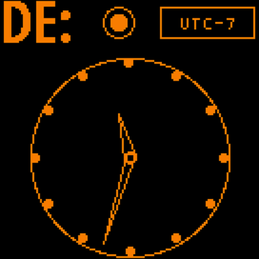

# 9M2PJU HamClock for Android

  

<h3 align="center">Official Public Releases for 9M2PJU HamClock Android Application</h3>

Standalone Amateur Radio Space Weather, Solar Telemetry, Satellite Tracker & HF Propagation Dashboard

  
  
  
  

---

## 📥 Direct APK Downloads

Download the latest release (**v1.0.6** — HamClock Core v4.32) below:

### 🚀 [Download 9M2PJU-HamClock.apk (Universal)](https://github.com/9M2PJU/9M2PJU-HamClock-Android-Releases/releases/latest/download/9M2PJU-HamClock.apk)
*Recommended for all Android smartphones, tablets, TV boxes, and car head units.*

---

### 📦 Architecture-Specific Packages

If you prefer smaller, optimized downloads for your specific device architecture:

| Download Link | Architecture | Target Devices | Size |
| :--- | :---: | :--- | :---: |
| [**`9M2PJU-HamClock-v1.0.6-arm64-v8a.apk`**](https://github.com/9M2PJU/9M2PJU-HamClock-Android-Releases/releases/latest/download/9M2PJU-HamClock-v1.0.6-arm64-v8a.apk) | `arm64-v8a` | Modern 64-bit ARM phones/tablets (Android 8.0+) | ~8.4 MB |
| [**`9M2PJU-HamClock-v1.0.6-armeabi-v7a.apk`**](https://github.com/9M2PJU/9M2PJU-HamClock-Android-Releases/releases/latest/download/9M2PJU-HamClock-v1.0.6-armeabi-v7a.apk) | `armeabi-v7a` | Older 32-bit ARM devices, legacy tablets | ~7.6 MB |
| [**`9M2PJU-HamClock-v1.0.6-x86_64.apk`**](https://github.com/9M2PJU/9M2PJU-HamClock-Android-Releases/releases/latest/download/9M2PJU-HamClock-v1.0.6-x86_64.apk) | `x86_64` | Android Emulators (BlueStacks/LDPlayer), x86 tablets | ~8.5 MB |
| [**`9M2PJU-HamClock-v1.0.6-x86.apk`**](https://github.com/9M2PJU/9M2PJU-HamClock-Android-Releases/releases/latest/download/9M2PJU-HamClock-v1.0.6-x86.apk) | `x86` | 32-bit Intel/AMD Android devices | ~8.7 MB |
| [**`checksums-sha256.txt`**](https://github.com/9M2PJU/9M2PJU-HamClock-Android-Releases/releases/latest/download/checksums-sha256.txt) | - | SHA-256 Checksums for package verification | ~560 B |

---

## ✨ Features

- ⚡ **HamClock v4.32 Native Engine**: Embedded C++ HamClock core engine updated to v4.32 with live APRS cluster, Sondehub balloon (HAB) tracking, HamAlert DX triggers, active wildfires, fire weather risks, marine storm warnings, WEFAX, IOTA, and on-screen modal virtual keyboard.
- 📱 **100% Standalone Native APK**: Embedded C++ HamClock engine running natively via Android NDK. No Termux or root needed!
- ⏳ **Polished Startup Splash Screen**: 2-second minimum branded splash screen with real-time daemon initialization diagnostics.
- 📝 **Rich-Text In-App Update Changelog**: Full Markdown formatting for update changelog rendering cleanly without asterisks.
- 📦 **Station Config Backup & Restore**: Full export & import of station EEPROM, presets, and Android preferences to `.zip` via Storage Access Framework (SAF) & Share Sheet.
- 🎨 **Ghost-Free Overlay Controls**: Smooth 100% fading and collapsing controls menu leaving zero shadow artifacts on screen.
- 🇲🇾 **Bahasa Melayu Localization**: Native Malaysian Malay translations.
- 📍 **GPS & Maidenhead Locator Sync**: Automatic GPS coordinates acquisition and real-time station DE grid locator update.
- 🌙 **OLED Burn-in Protection & Night Dimmer**: Pixel-shift and night auto-dimmer to extend display life for 24/7 shack monitors.
- 📺 **Android TV & Car Head Unit Ready**: D-Pad remote navigation and auto power connection management.
- 🖥️ **Full-Screen Immersive UI**: Edge-to-edge hardware-accelerated rendering with zero distraction borders.
- ⚡ **24/7 Shack Station Daemon**: Background Foreground Service with optional `WakeLock` / `WifiLock` for dedicated desk monitors.
- 📡 **Local Network / Shack Sharing**: Access the live interactive screen from your PC or iPad at `http://<PHONE-IP>:8081/live.html`.
- 🔄 **Auto-Start on Boot**: Automatically launches on system boot (ideal for dedicated tablet installations).
- 🛠️ **In-App Diagnostics**: Live real-time logcat diagnostics viewer.

---

## 📲 Installation Instructions

1. Download **[`9M2PJU-HamClock.apk`](https://github.com/9M2PJU/9M2PJU-HamClock-Android-Releases/releases/latest/download/9M2PJU-HamClock.apk)** to your Android device.
2. Tap the downloaded file to install. If prompted, enable **"Install unknown apps"** for your browser or file manager.
3. Open **9M2PJU HamClock**. The app will initialize the C++ core engine and load your live space weather dashboard.
4. *(Optional)* Tap the overlay menu in the top-right corner to toggle **Keep Screen On** or view your **Station LAN Link**.

---

## 🌐 Network Endpoints

| Service | Port | Endpoint | Description |
| :--- | :---: | :--- | :--- |
| **Interactive Touch Screen** | `8081` | `http://localhost:8081/live.html` | Real-time WebSocket interactive dashboard |
| **Backend RESTful API** | `8080` | `http://localhost:8080/` | HTTP control and telemetry API |
| **Read-Only Monitor Screen** | `8082` | `http://localhost:8082/live.html` | Passive display for remote monitors / OBS streams |

---

## 📜 License & Acknowledgments

- **Original HamClock Author**: Elwood Downey (**WB0OEW**), Clear Sky Institute
- **Android App & Packaging**: **9M2PJU** ([https://hamradio.my](https://hamradio.my))
- Released under the [MIT License](LICENSE).
